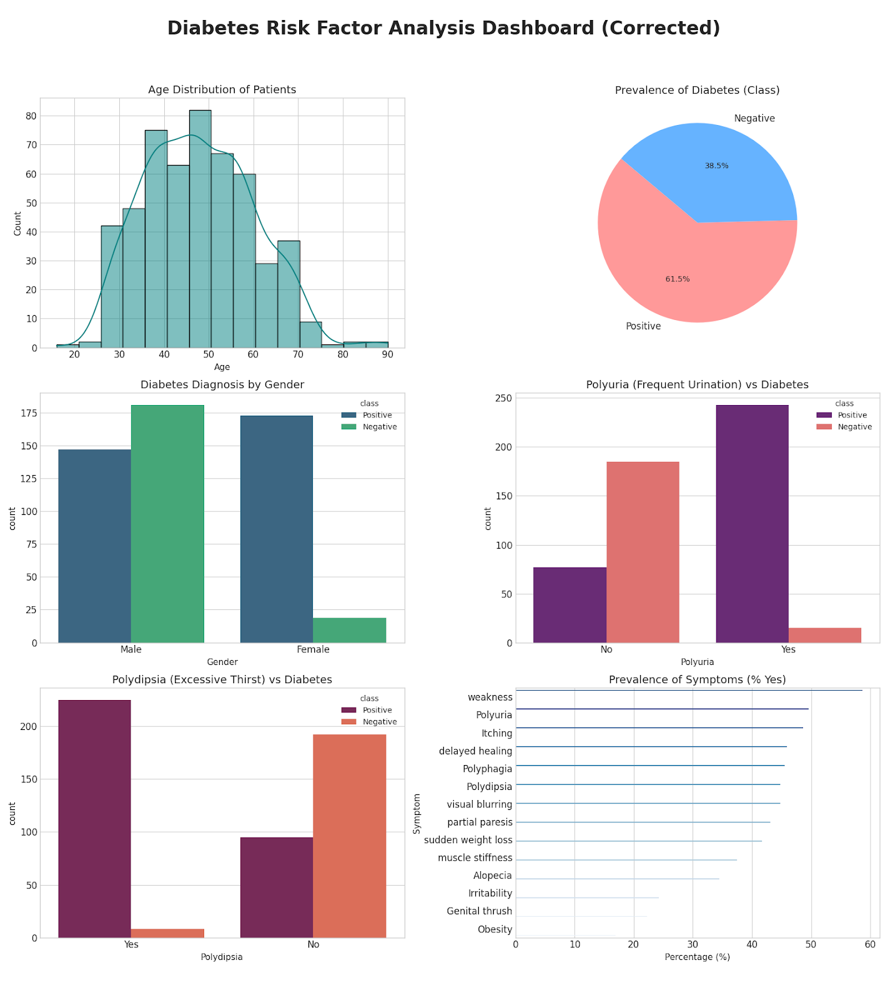
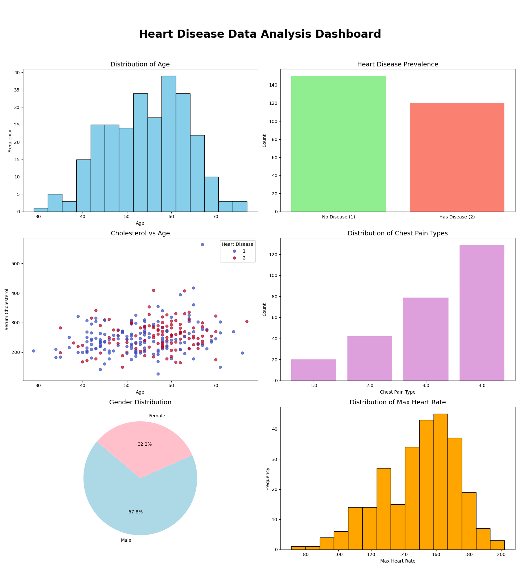

# Combined Health Analysis: Heart Disease & Diabetes

**Team Name:** STAY  
**Team ID:** EV29  
**Event:** ENVISION 2025-26

---

## 📌 Project Overview

This project aims to analyze and visualize critical risk factors associated with **Heart Disease** and **Early-Stage Diabetes**. By leveraging datasets acquired through web scraping and public repositories, we have developed a series of data dashboards to identify patterns in patient demographics, symptoms, and clinical measurements.

The analysis provides valuable insights into:
- Prevalence of key symptoms and risk factors
- Gender-based diagnosis distribution
- Age demographics and health correlations
- Clinical measurement patterns
- Integrated health trends across both conditions

---

## 📊 Visual Analysis Dashboards

### 1. **Diabetes Risk Factor Analysis**
Focuses on the prevalence of symptoms like:
- **Polyuria** (excessive urination)
- **Polydipsia** (excessive thirst)
- Gender-based diagnosis distribution
- Age demographics and symptom correlations

### 2. **Heart Disease Data Analysis**
Examines the relationship between:
- **Cholesterol levels** and heart disease
- **Chest pain types** across different demographics
- **Maximum heart rate** patterns
- Presence of heart disease across different age groups
- Exercise-induced angina and other cardiac indicators

### 3. **Integrated Health Dashboard**
A side-by-side comparison of Heart Disease and Diabetes metrics to identify broader health trends in the dataset, enabling:
- Cross-condition risk factor analysis
- Comprehensive patient health profiling
- Population-level health insights






---

## 📂 Datasets Used

The data for this project was consolidated from various sources, including direct downloads and web scraping from the **UCI Machine Learning Repository**:

| Dataset | Description | Source |
|---------|-------------|--------|
| **UCI Heart Disease Dataset** | Contains 270 patient records with 14 clinical features including age, sex, chest pain type, cholesterol, blood pressure, and heart disease diagnosis | [Link](https://archive.ics.uci.edu/dataset/45/heart+disease) |
| **Statlog (Heart) Dataset** | Additional heart disease data for comprehensive analysis | [Link](https://archive.ics.uci.edu/dataset/145/statlog+heart) |
| **Early Stage Diabetes Risk Prediction** | Contains 520 patient records with 17 symptoms/risk factors including Polyuria, Polydipsia, obesity, and diabetes diagnosis | [Link](https://archive.ics.uci.edu/dataset/529/early+stage+diabetes+risk+prediction+dataset) |

### Dataset Files in Repository:
- `heart.csv` - Heart disease patient data (270 records)
- `diabetes_data_upload.csv` - Diabetes risk factor data (520 records)
- `heart+disease.zip` - Original UCI heart disease dataset archive

---

## 📈 Project Structure

```
EV29_Team-STAY/
├── README.md                          # Project documentation
├── heart.csv                          # Heart disease dataset
├── diabetes_data_upload.csv           # Diabetes dataset
├── heart+disease.zip                  # Original UCI dataset archive
├── uci_scraped_links.csv             # Web scraping metadata
├── Code_Generated_Image.png          # Analysis visualizations
├── Code_Generated_Image.pdf          # PDF version of visualizations
└── heart_disease_dashboard.png       # Heart disease dashboard
```

---

## 🛠️ Tech Stack

- **Language:** Python 3.x
- **Data Processing:** Pandas, NumPy
- **Visualization:** Matplotlib, Seaborn, Plotly
- **Data Sourcing:** Web Scraping & CSV Integration
- **Development Environment:** Jupyter Notebook / Python Scripts

### Key Libraries:
```python
pandas          # Data manipulation and analysis
matplotlib      # Static visualizations
seaborn         # Statistical data visualization
plotly          # Interactive dashboards
numpy           # Numerical computing
```

---

## 🚀 Getting Started

### Prerequisites
- Python 3.7 or higher
- pip (Python package manager)

### Installation

1. **Clone the repository:**
   ```bash
   git clone https://github.com/smitpatil06/EV29_Team-STAY.git
   cd EV29_Team-STAY
   ```

2. **Install required packages:**
   ```bash
   pip install pandas matplotlib seaborn plotly numpy
   ```

3. **Verify datasets:**
   Ensure the following CSV files are present:
   - `heart.csv`
   - `diabetes_data_upload.csv`

### Usage

The project includes pre-generated visualizations:
- View `Code_Generated_Image.png` for combined analysis
- View `heart_disease_dashboard.png` for heart disease-specific insights
- View `Code_Generated_Image.pdf` for comprehensive analysis report

To regenerate or modify visualizations, use Python with the installed libraries to analyze the CSV datasets.

---

## 📊 Key Features

### Heart Disease Analysis:
- ✅ Age and gender distribution analysis
- ✅ Cholesterol level patterns
- ✅ Chest pain type classification
- ✅ Maximum heart rate correlations
- ✅ Exercise-induced angina indicators
- ✅ ST slope and ECG measurements

### Diabetes Risk Analysis:
- ✅ Symptom prevalence (Polyuria, Polydipsia)
- ✅ Gender-based risk factors
- ✅ Age demographics
- ✅ Weight-related indicators (obesity, sudden weight loss)
- ✅ Secondary symptoms (visual blurring, delayed healing)
- ✅ Risk prediction classification

---

## 📜 Event Rule Book & Compliance

This project is developed under the **2025-26 ENVISION** guidelines. Team STAY (EV29) adheres to the following:

### Competition Rules:
- ✅ **No Device Switching:** All work is performed on the registered system. No network or system switches without prior approval.
- ✅ **Camera Verification:** Compliance with random camera checks within the 2-minute mandatory window.
- ✅ **Session Recording:** Acknowledgment that screen-sharing sessions may be recorded for audit and fairness.
- ✅ **Hardware Limitation:** Work is performed strictly on Laptop/Desktop only.
- ✅ **Zero-Tolerance Policy:** We maintain full transparency in our coding process, avoiding pre-built solutions or suspicious activity to ensure a fair competition.

### Ethical Considerations:
- All datasets are publicly available and properly cited
- Data sourcing follows ethical web scraping practices
- Patient data is anonymized and used solely for educational purposes
- Compliance with data usage policies from UCI Machine Learning Repository

---

## 📸 Visualizations

The project includes comprehensive data visualizations:

1. **Code_Generated_Image.png** - Combined health analysis dashboard
2. **heart_disease_dashboard.png** - Heart disease-specific insights
3. **Code_Generated_Image.pdf** - Multi-page analysis report

These visualizations provide:
- Distribution plots for demographic data
- Correlation heatmaps for risk factors
- Comparative analysis charts
- Statistical summaries and insights

---

## 👥 Team Information

**Team Name:** STAY  
**Team ID:** EV29  
**Event:** ENVISION 2025-26  
**Institution:** [Your Institution Name]  
**Project Category:** Data Analysis & Visualization

---

## 📝 License

This project is developed for educational purposes as part of ENVISION 2025-26 competition.

---

## 🔗 References

- UCI Machine Learning Repository: https://archive.ics.uci.edu/
- Heart Disease Dataset: https://archive.ics.uci.edu/dataset/45/heart+disease
- Statlog Heart Dataset: https://archive.ics.uci.edu/dataset/145/statlog+heart
- Diabetes Risk Prediction: https://archive.ics.uci.edu/dataset/529/early+stage+diabetes+risk+prediction+dataset

---

## 📞 Contact

For questions or collaboration opportunities related to this project, please refer to the team contact information provided during the ENVISION 2025-26 event.

---

**Last Updated:** December 2025  
**Status:** Active Development for ENVISION 2025-26
